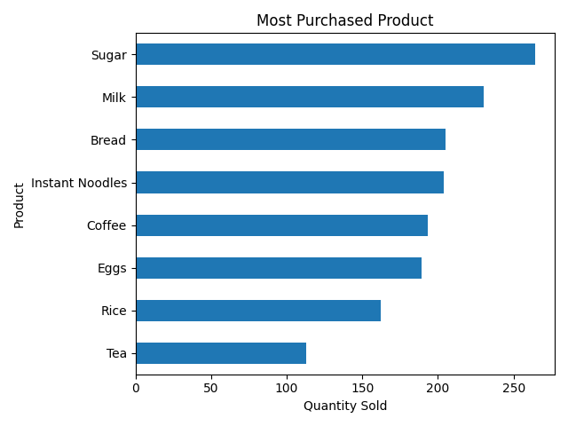
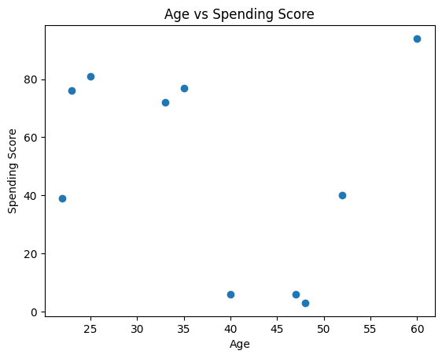
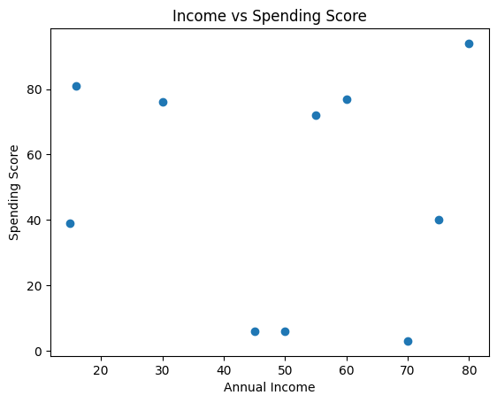
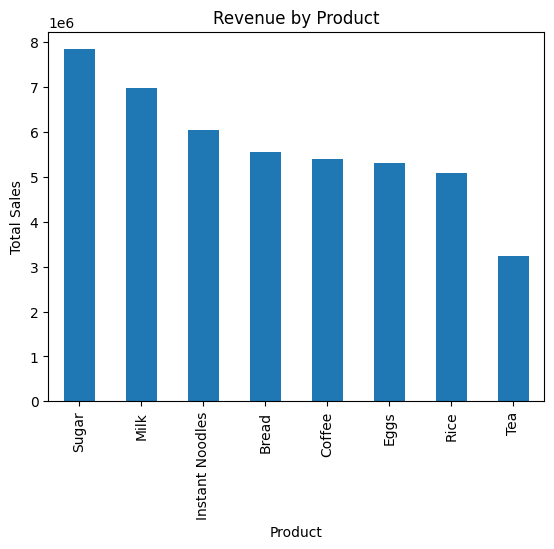

# Data-Analyst-Portfolio-
Data Analyst Portfolio |Python | SQL | Power BI |

Welcome to my Data Analyst Portfolio.  
This repository showcases my data analysis projects using Python, SQL, and data visualization tools.

# 📊Data Analyst Portfolio

## 👋 Wiyandasari Siboro
Halo! Saya Wiyandasari M. Nadine Siboro, seorang aspiring Data Analyst dengan latar belakang Teknik Informatika yang tertarik dalam analisis data, visualisasi, dan menemukan insight dari data untuk membantu pengambilan keputusan.

🎓 Pendidikan
S1 Teknik Informatika
IPK: 3.37
📍 Location: Bandung, Indonesia

## 🛠 Tools & Technologies
* Python (Pandas, Matplotlib, Seaborn)
* SQL
* Excel
* Power BI

# Portfolio Projects
# 📂 Project 1
## 📈 Sales Data Analysis (python)
Analisis dataset penjualan menggunakan Python untuk menemukan pola penjualan dan insight bisnis:
* Produk dengan revenue tertinggi
* Kota dengan penjualan terbesar
* Produk paling sering dibeli
* Tren penjualan

### Business Questions
1. Produk apa yang menghasilkan penjualan terbesar?
2. Kota mana dengan penjualan tertinggi?
3. Produk apa yang paling sering dibeli pelanggan?

## 🛠 Tools & Technologies
Python
Pandas
Matplotlib

## 📊 Visualization
### Revenue by Product

### Sales by City

### Most Purchased Product

👉 [Lihat Python Analysis](projects/sales_analysis.ipynb)

### Key Insights
- Produk dengan revenue tertinggi adalah **Milk**
- Kota dengan penjualan terbesar adalah **Jakarta**
- Produk yang paling sering dibeli adalah **Bread**

# 📂 Project 2
## 👥 Customer Segmentation Analysis
Analisis data customer untuk memahami perilaku pembelian dan segmentasi pelanggan.

### Business Questions
1. Siapa customer dengan spending tertinggi?
2. Apakah usia mempengaruhi spending?
3. Bagaimana segment customer berdasarkan income dan spending?

## 🛠 Tools & Technologies
Python
Pandas
Matplotlib

#### Age vs Spending Score

#### Income vs Spending Score

👉 [Lihat Python Analysis](projects/customer_segmentation.ipynb)

### Key Insights
- Customer dengan **income tinggi tidak selalu memiliki spending tinggi**
- Usia **20–35 tahun memiliki spending score paling tinggi**
- Terdapat segment customer dengan **high income & high spending**

# 📂 Project 3
## 🗄️ E-Commerce SQL Analysis
Analisis data transaksi e-commerce menggunakan SQL untuk menemukan insight bisnis.
Analisis yang dilakukan:
- Total revenue
- Best selling product
- Sales by city
- Average sales per product
  
### Business Questions
1. Siapa customer dengan total pembelian tertinggi?
2. Produk apa yang menjadi best selling product?
3. Berapa total revenue setiap bulan?
4. Kota mana dengan jumlah customer terbanyak?

## 🛠 Tools & Technologies
SQL  
Excel/CSV

👉 [Lihat SQL Analysis](ecommerce_sql_analysis.sql)

### Key Insights
- Produk dengan penjualan tertinggi memberikan kontribusi terbesar terhadap revenue
- Beberapa customer memiliki kontribusi pembelian yang jauh lebih tinggi dibanding yang lain
- Revenue menunjukkan tren peningkatan pada bulan tertentu

# 📂 Project 4
## 📊 Dashboard Project (Data Visualization Project)
Membuat dashboard interaktif untuk memvisualisasikan performa penjualan dan membantu pengambilan keputusan bisnis.
- Dashboard Features
- Total Sales
- Sales by Product
- Sales by CityN
- Monthly Sales Trend

## 🛠 Tools & Technologies
Power BI

## 📊 Dashboard Preview

### Key Insights
- Produk tertentu mendominasi penjualan
- Beberapa kota memiliki kontribusi penjualan lebih tinggi
- Penjualan menunjukkan tren meningkat dari waktu ke waktu

Dashboard ini menampilkan insight visual mengenai performa penjualan untuk memudahkan analisis data secara cepat dan interaktif.

👉[Download Power BI Dashboard](dashboard/sales_dashboard.pbix)

# 📂 Project 5
## 📊 E-Commerce Sales Exploratory Data Analysis
Exploratory data analysis of e-commerce sales dataset to understand sales performance and business trends.

### Business Questions
1. What products generate the highest revenue?
2. Which cities have the highest sales?
3. What is the monthly sales trend?

## 🛠 Tools & Technologies
Python  
Pandas  
Matplotlib  

### Visualization

👉 [Lihat Python Analysis](projects/ecommerce_sales_analysis.ipynb)

### Key Insights
- Certain products contribute significantly to total revenue
- Sales are concentrated in major cities
- Sales trend shows seasonal patterns
  
# 📫 Contact
📧 [wiyandasari712 @gmail.com](mailto:wiyandasari712@gmail.com)
📍 Bandung, Indonesia
🔗 LinkedIn: https://linkedin.com/in/wiyandasari-m-nadine-siboro

⭐ This portfolio showcases my data analysis projects using Python, SQL, and BI tools to demonstrate my skills in data cleaning, analysis, and visualization.
