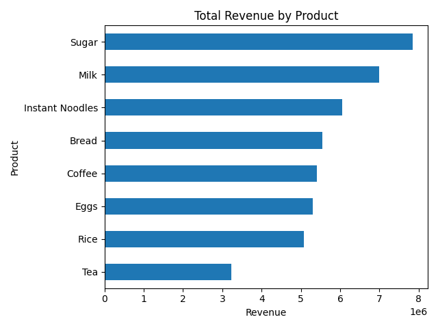
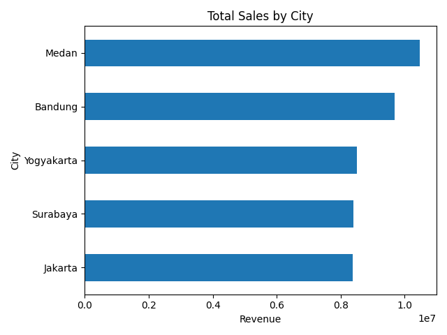

# Data-Analyst-Portfolio-
Data Analyst Portfolio | Python SQL Tableau | Bandung

# 📊Data Analyst Portfolio

## 👋 Wiyandasari Siboro
Halo! Saya Wiyandasari M. Nadine Siboro, seorang aspiring Data Analyst dengan latar belakang Teknik Informatika yang tertarik dalam analisis data, visualisasi, dan menemukan insight dari data untuk membantu pengambilan keputusan.

🎓 Pendidikan
S1 Teknik Informatika
IPK: 3.37
📍 Location: Bandung, Indonesia

# Tools:
* Python (Pandas, Matplotlib, Seaborn)
* SQL
* Tableau
* Excel
* Power BI

# 📂 Project 1
## 📈 Sales Data Analysis
Analisis dataset penjualan untuk menemukan insight bisnis seperti:
* Produk dengan revenue tertinggi
* Kota dengan penjualan terbesar
* Produk paling sering dibeli
* Tren penjualan

### Business Questions
1. Produk apa yang menghasilkan penjualan terbesar?
2. Kota mana dengan penjualan tertinggi?
3. Produk apa yang paling sering dibeli pelanggan?

### 🛠 Tools
Python
Pandas
Matplotlib

## 📊 Visualization
### Revenue by Product

### Sales by City

### Most Purchased Product

👉 [Lihat Python Analysis](projects/sales_analysis.ipynb)

### Key Insights
- Produk dengan revenue tertinggi adalah **Milk**
- Kota dengan penjualan terbesar adalah **Jakarta**
- Produk yang paling sering dibeli adalah **Bread**

# 📂 Project 2
## 👥 Customer Segmentation Analysis
Analisis data customer untuk memahami perilaku pembelian dan segmentasi pelanggan.

### Business Questions
1. Siapa customer dengan spending tertinggi?
2. Apakah usia mempengaruhi spending?
3. Bagaimana segment customer berdasarkan income dan spending?

### 🛠 Tools
Python
Pandas
Matplotlib

#### Age vs Spending Score

#### Income vs Spending Score

👉 [Lihat Python Analysis](projects/customer_segmentation.ipynb)

# 📂 Project 3
## 🗄️ E-Commerce SQL Analysis
Analisis data transaksi e-commerce menggunakan SQL untuk menemukan insight bisnis.

### Business Questions
1. Siapa customer dengan total pembelian tertinggi?
2. Produk apa yang menjadi best selling product?
3. Berapa total revenue setiap bulan?
4. Kota mana dengan jumlah customer terbanyak?

### Tools
SQL  
Excel/CSV

👉

# 📂 Project 4
## 📊 Dashboard Project (Data Visualization Project)
Membuat dashboard interaktif untuk memvisualisasikan performa penjualan dan membantu pengambilan keputusan bisnis.
- Dashboard Features
- Total Sales
- Sales by Product
- Sales by CityN
- Monthly Sales Trend

### Tools
Tableau / Power BI

Example Dashboard
Dashboard ini menampilkan insight visual mengenai performa penjualan untuk memudahkan analisis data secara cepat dan interaktif.

👉

# 📫 Contact

📧 [wiyandasari712 @gmail.com](mailto:wiyandasari712@gmail.com)
📍 Bandung, Indonesia
🔗 LinkedIn: https://linkedin.com/in/wiyandasari M. Nadine Siboro

⭐ Portfolio ini berisi beberapa project data analysis untuk menunjukkan kemampuan saya dalam data cleaning, exploratory data analysis, SQL querying, dan data visualization menggunakan Python, SQL, dan BI tools.
